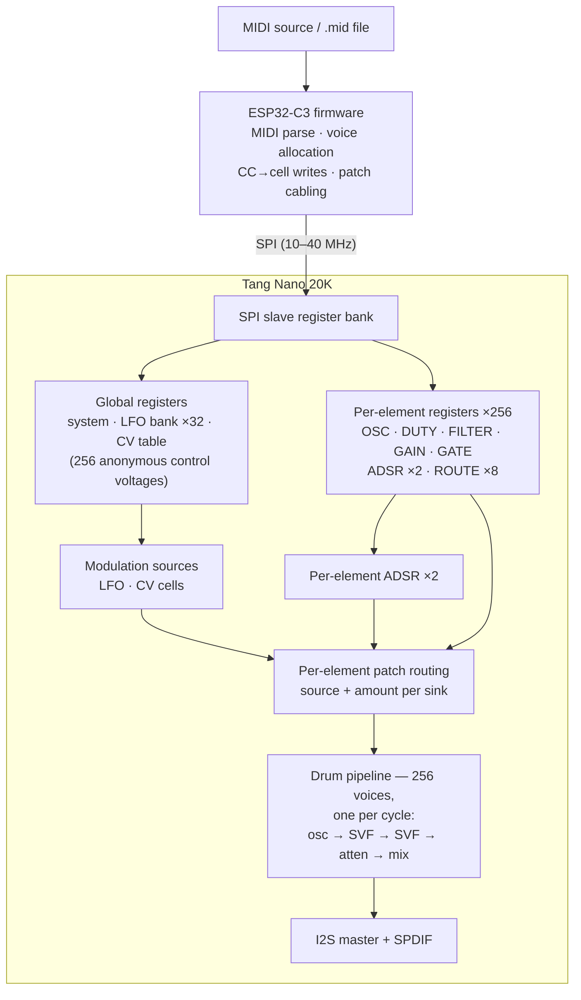
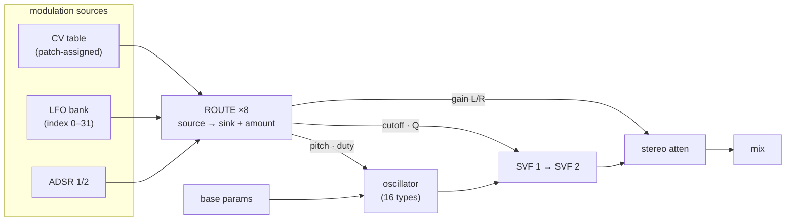

# SPI Memory Map — Noaidi Synth

Draft register/address-space map for the ESP32-C3 ↔ FPGA SPI control interface.
Status: **proposal for discussion** — most sections are not yet implemented.

## Architecture stance

The FPGA is a dumb-but-fast synthesis engine: 256 independent
single-oscillator voices. It has no concept of notes, unison, polyphony,
MIDI or CCs — all of that is ESP32 firmware territory (think 256 Minimoog
voice cards behind a MIDI-to-CV converter). Consequences:

- ESP32 does voice allocation, unison grouping, CC→parameter mapping and
  velocity scaling; it expresses results as plain per-element register writes.
- **Per-element ADSRs live in the FPGA (256 of them)** — envelopes are
  per-sample math, far too expensive to stream from firmware.
- The only "event" interface is a per-element `GATE` register (gate /
  retrig), written directly by the firmware allocator. Quantities fixed
  at note-on — key tracking, velocity scaling, detune, pan — are baked
  by firmware into base parameters and route amounts; the FPGA's
  modulation sources are only things that *change during a note*.
- **Patch panel**: continuous external values live in a **CV table** —
  a flat array of anonymous control voltages (the FPGA's only notion of
  "external input"). The firmware's patch assigns MIDI streams to CV
  cells once per program (CV[3] = wheel ch 2, CV[7] = CC 11 ch 5, ...);
  each incoming event is then one cell write, with no re-mapping during
  play. Each voice carries small **routing words** that pick which CV (or
  internal source) modulates which parameter and by how much. The ESP32
  "patches the cables" when it allocates a note's voices; afterwards a
  whole pedal sweep costs one cell write. Key tracking that must follow
  extreme pitch bends just rides a CV cell updated by firmware — no
  special path.
- **Multi-timbrality is free for per-element parameters**: every voice
  carries its own params, so 16 channels can each run a different patch
  at no extra cost. Only genuinely global resources need per-channel
  instances — the LFO bank covers that; master volume stays global.
- FPGA-side parameter smoothing (first-order LPF, design doc) is what
  makes low-rate firmware updates of running voices sound clean.

## Block diagrams



One voice's signal flow:



## Conventions

- **Register width: 32 bits, uniform.** One register = one parameter (or
  one small related group). Native BSRAM words are 36-bit; a 32-bit
  register occupies one word with 4 spare bits reserved.
- **CDC via BSRAM ports**: the SPI side writes on the sclk-clocked port
  and the drum reads on the sysclk-clocked port — the dual-clock,
  dual-port BSRAM *is* the entire clock-domain crossing. No FIFOs, no
  handshakes, no inbox. **Builds cleanly, but is NOT yet functionally
  verified** — see "BSRAM CDC — measured" below. yosys infers it,
  nextpnr packs it, gowin_pack emits a bitstream, and the netlist is
  structurally correct; but the open-source flow ships no simulation
  model for the primitive, so nothing has confirmed it *behaves*.
- What BSRAM does and does not buy you. It solves the *structural*
  crossing: each port is fully synchronous to its own clock, no
  combinational path runs between domains, and there is no metastability
  on the data path. It does **not** make a read-during-write coherent —
  a word read on sysclk while it is being written on sclk can return old
  or new data for that access. That is precisely why parameter data is
  ping-ponged (atomicity is the bank swap's job, not the RAM's), and why
  the bank-select bit is the one signal in the whole scheme that genuinely
  has to be synchronised.
- **Address width: 16 bits** (65,536 words = 256 KB logical space).
- **Section sizing**: power-of-two units, at least 50% spare per unit or
  block, and 0x100-aligned only where that doesn't waste most of the
  block (no oversized reservations like 256 words for two LFOs).
- **Per-element stride: 64 words (2^6)** — 15 used, 49 reserved (76%
  headroom per voice).
- **Transaction format** (proposal): 1 command byte + 2 address bytes +
  4 data bytes per word. Command: `[7] R/W`, `[6] auto-increment (burst)`,
  `[5:0] reserved`. A burst streams words while CS is low.
- **Atomicity**: per-element register writes are independent; multi-word
  atomicity comes from the ping-pong bank swap, not from locking registers.
- **Ping-pong**: parameter data (OSC, DUTY, FILTER, GAIN, ADSR, ROUTE,
  LFO params) is double-buffered, half-active/half-shadow; the map
  exposes the active bank only. Writes always land in the shadow half
  (the sclk-side bank select is a synced complement of the active
  bank). A `CTRL` swap request executes once, at the next sample
  boundary, in an idle drum slot where no voice reads occur — that is
  the one critical cycle, and nothing but the bank pointer changes in
  it. `STATUS` reports swap completion. There is no "patch" vs "live"
  parameter class (correction from Thor, design doc): swaps run
  thousands of times per second, everything is live, and every change
  is effected through a swap. Whether GATE and CV cells also route
  through the banks or stay single-banked is an implementation choice
  per section, made when each is built — the swap mechanism is not the
  bottleneck.

## Top-level map

| Address          | Section                       | Size      | Status |
|------------------|-------------------------------|-----------|--------|
| `0x0000–0x00FF`  | System / housekeeping         | 256 words | TBD |
| `0x0100–0x02FF`  | LFO bank (32 × 16 words, 2 per channel) | 512 words | TBD |
| `0x0300–0x03FF`  | Reserved (global)             | 256 words | — |
| `0x0400–0x04FF`  | CV table (anonymous control voltages) | 256 words | TBD |
| `0x0500–0x07FF`  | Reserved (global)             | 768 words | — |
| `0x0800–0x0BFF`  | Bus base registers (write-only, live — [bus_architecture.md](bus_architecture.md)) | 1024 words | B1: live |
| `0x0C00–0x1FFF`  | Reserved (global)             | ~5K words | — |
| `0x2000–0x5FFF`  | Per-element parameters (256 × 64) | 16K words | partial |
| `0x6000–0xFFFF`  | Reserved (effects, wavetables, samples) | 40K words | — |

## System / housekeeping — `0x0000–0x00FF` (TBD)

| Offset | Register | Contents |
|--------|----------|----------|
| `0x000` | `ID` | ID/version, read-only |
| `0x001` | `STATUS` | link status, drop counters, bank-swap done |
| `0x002` | `CTRL` | global reset, kill-all-gates (panic), LED override, swap request |
| `0x003` | `MASTER` | `[7:0]` vol L UQ4.4, `[15:8]` vol R UQ4.4, `[23:16]` smoothing coeff |
| `0x004–0x0FF` | — | reserved |

No command FIFO: note-on/off is just the allocator writing per-element
`GATE` registers — nothing else in the FPGA needs to know a "note" exists.
No MIDI interpretation: the FPGA stores anonymous control voltages and
knows nothing of wheels, pedals or CC numbers — every musical decision
and every mapping stays in firmware.

## Producer table — `0x0100–0x01FF` (live, B4)

128 producers × 2 words, stride 2, banked like parameters (config is
wiring — takes effect at the swap). See
[bus_architecture.md](bus_architecture.md).

| Offset | Word | Contents |
|---|---|---|
| `+0` | `CFG` | `[3:0]` type (0 off, 1 LFO), `[5:4]` shape (saw/pulse/tri/sine via osc_core), `[15:6]` target bus, `[31:16]` rate — low 16 bits of the UQ0.24 phase increment (5.7 mHz steps, 375 Hz max) |
| `+1` | `DEPTH` | `[17:0]` signed Q8.10 contribution amplitude |

A producer ADDS to its target bus's base register (bus value = base +
contribution), so firmware writes and producer modulation coexist on
one bus. One producer per bus for now; summing multiple producers
onto one bus is the combiner's job (B6). Disabling a producer leaves
its last value on the bus until the next base write refreshes it.

> **SUPERSEDED (2026-08-30):** the old LFO bank, CV table and
> per-element routing sections below are replaced by the bus
> architecture. They remain here as design history.

## LFO bank — `0x0100–0x02FF` (superseded, see above)

32 LFOs — 2 per patch/channel, so 16-channel multi-timbral arrangements
each get their own LFOs. The FPGA sees only an anonymous bank; firmware
maps LFO number ↔ (channel, slot) at patch setup, and per-element route
words reference LFOs by index (0..31). The LFOs are time-multiplexed
through the drum's idle slots (32 cycles per sample, ~740 available) and
present their current outputs as registers for the cable mux.

LFO k base address: `0x100 + k × 16` (16 words each; 5 used, 11 reserved):

| Offset | Register | Contents |
|---|---|---|
| `+0` | `RATE` | `[23:0]` phase increment UQ0.24, `[31:24]` rate divider — effective rate = delta / (div + 1); the divider gives smooth very-slow LFOs without widening the accumulator |
| `+1` | `SHAPE` | `[3:0]` waveform (sine, tri, saw, ramp, S&H, ...), `[7:4]` reserved |
| `+2` | `DEPTH` | `[23:0]` Q0.24 — live patch-level scalar: per-element route amounts set the static part, DEPTH is what a mod wheel/CC scales at run time (firmware writes it once per event) |
| `+3` | `PHASE` | `[23:0]` UQ0.24 (set/sync: firmware writes it to retrigger) |
| `+4` | `SYNC` | retrig mode (free-run vs on-PHASE-write) |
| `+5..+15` | — | reserved |

The LFO phase accumulator is UQ0.24 like the oscillators, and its
waveform generation reuses the `osc_core` shape generator — LFOs and
voices share the same oscillators-under-the-hood.

## CV table — `0x0400–0x04FF` (TBD)

A flat array of anonymous control voltages — `CV[0..255]`, 16-bit values
per cell. The FPGA knows nothing of wheels, pedals or CC numbers.

- Firmware's patch assigns MIDI streams to cells once per program (e.g.
  `CV[0]` = wheel ch 2, `CV[1]` = expression ch 7). During play, an
  incoming event is a single cell write — no bus allocation, no
  repatching, no sync.
- 256 cells cover the simultaneously-active continuous streams of a full
  arrangement (16 wheels + a handful of pedals/mod wheels ≈ 40) with
  room to spare; a patch that never uses a cell costs nothing.
- **Global vs per-element is not an FPGA concept**: a cell referenced by
  many voices' routes is "global"; a cell referenced by one note's
  routes is per-note (poly pressure). The ESP32 allocates cells as it
  pleases — the hardware never knows the difference.
- Global *parameters* (LFO depth, master volume) are plain registers,
  written directly by firmware; they need no routing at all.
- BSRAM cost: 256 × 36-bit words = 1 block.
- **Write path**: SPI writes land directly on the sclk-clocked BSRAM
  write port (dual-clock, dual-port — no FIFOs). Reads back to the ESP32
  are serviced by the drum in an idle slot: fetch the active value, hand
  it to a response register, sync it to the sclk domain; the protocol
  layer returns it with the status byte. A write is live the instant it
  lands; a read costs one idle slot.

## Per-element routing — the patch panel (TBD)

- **Eight generic cables per voice** (`ROUTE[0..7]`), each connecting any
  source to any sink with a signed amount. Multiple cables may target the
  same sink (e.g. wheel + LFO both → pitch); contributions sum in cable
  order, so order is deterministic but not meaningful.
- **Sources** (4-bit type): none, CV, LFO (index 0..31), ADSR1, ADSR2 —
  only time-varying signals; note-on-static values (velocity, key
  tracking) are baked by firmware into base parameters and route
  amounts. For CV, the 11-bit index = cell number (0..255); for LFO,
  the index = LFO number; ADSR sources ignore it.
- **Sinks** (3-bit): osc pitch, osc duty, filter cutoff, filter Q,
  gain L, gain R, two reserved (future: pan, osc mix, ...).
- Routing is applied inside the pipeline where each sink is consumed
  (pitch/duty before the oscillator stage, cutoff/Q before the SVF
  stages, gains before attenuation); each cable gets a pipeline stage
  slot, and unused cables skip their CV-table read. The doc's
  first-order LPF smoothing applies per sink after the sum.
- Cost note: each active cable costs one CV-table read per voice.
  The table has one pipeline read port (the other BSRAM port is the
  SPI write port), so 8 cables = 8 read stages with overlapped
  multiplies/adds. Projected pipeline budget (one stage = one voice per
  cycle): S1 RAM read (state + params + routes + ADSR) → ADSR ×2
  (4 stages) → 8 cables (≈10 stages) → smoothing (1) → osc LUTs +
  waveform (2) → SVF1 (3) → SVF2 (3) → atten (1) → mix + writeback (1)
  ≈ **27–28 stages**. Span = 256 + K − 1 ≈ 283 slots (~28% of the drum
  rotation; today 12 stages / 267 slots). The critical path stays the
  SVF combine, so fmax is ~unchanged.
- BSRAM: ~21–26 blocks of 46 with 8 cables + packed ADSR params. The
  binding constraint is *read-port width* (≈660+ bits read simultaneously
  at S1 across ~19 parallel arrays), not block count. If cables ever
  double to 16, split route reads across two cycles to halve the ports.

A fallback without the CV table exists: firmware computes target values
and writes per-element parameters directly (viable: a 200 Hz pedal sweep
over 256 voices ≈ 2.9 Mbit/s). The table wins for dense multi-channel
arrangements by keeping SPI traffic near zero and removing the
firmware-side routing bookkeeping entirely.

## Per-element parameters — `0x2000–0x5FFF`

Voice v base address: `0x2000 + v × 64`.

| Offset | Register | Contents | Status |
|--------|----------|----------|--------|
| `+0` | `OSC` | `[15:0]` pitch (UQ4.10 in `[13:0]`, `[15:14]` reserved), `[19:16]` osc type (0 saw, 1 pulse, 2 tri, 3 sine, 4–15 reserved: noise, wavetable, sample, ...), `[20]` phase reset, `[31:21]` reserved | implemented |
| `+1` | `DUTY` | `[23:0]` duty Q0.24 signed, `[31:24]` reserved | implemented |
| `+2` | `FILTER` | `[15:0]` cutoff (UQ4.10 in `[13:0]`, `[15:14]` reserved), `[31:16]` resonance 1/Q Q2.14 | implemented |
| `+3` | `GAIN` | `[7:0]` gain L UQ4.4, `[15:8]` gain R UQ4.4, `[23:16]` mode byte: `[16]` 12/24 dB, `[18:17]` filter type, `[19]` smoothing coeff select, `[23:20]` reserved | implemented |
| `+4` | `GATE` | `[0]` gate (0 = silent: gain decode forced to exact mute, oscillator/filters free-run; later the ADSR trigger), `[1]` retrig (reserved), `[31:2]` reserved | bit 0 implemented |
| `+5` | `PTRS0` | bus pointers ([bus_architecture.md](bus_architecture.md)): `[9:0]` pitch, `[19:10]` duty, `[29:20]` cutoff — 0 = bus 0 = no modulation | cutoff live (B1) |
| `+6` | `PTRS1` | bus pointers: `[9:0]` filter 1/Q, `[19:10]` gain L, `[29:20]` gain R | live (B2) |
| `+5` | `ADSR1` | `[7:0]` A, `[15:8]` D, `[23:16]` S UQ4.4, `[31:24]` R — times are log2: 4-bit octave + 4-bit fraction (1/16 octave per LSB), decoded to linear via the LUT+barrel-shift pattern | TBD |
| `+6` | `ADSR2` | same layout (amp + filter) | TBD |
| `+7..+15` | — | envelope curve, sustain shape, ... | reserved |
| `+16..+23` | `ROUTE[0..7]` | patch cables: `[3:0]` source type, `[14:4]` source index, `[17:15]` sink (0 pitch, 1 duty, 2 cutoff, 3 Q, 4 gain L, 5 gain R, 6–7 reserved), `[31:18]` amount sQ2.12 | TBD |
| `+24..+63` | — | per-element LFO, glide, FM amount, sample position, ... | reserved |

Notes:
- 256 voices, each with its own ADSR(s) — grouping into notes/unison is
  firmware's business and invisible here.
- Values are consumed once per sample per voice (S1 stage); writes to a
  running voice take effect the next sample, smoothed by the per-element
  first-order LPF where enabled.
- `FILTER` resonance is stored Q2.14 (16-bit) and widened internally to
  the pipeline's Q8.28.
- ADSR registers are deliberately narrow: MIDI controllers are 7-bit, so
  8-bit log2 time fields (4-bit octave + 4-bit 1/16-octave fraction) and
  an 8-bit UQ4.4 sustain match the sources' precision while keeping one
  32-bit word per envelope. Decode to linear happens in the pipeline via
  the same LUT+barrel-shift machinery as pitch and gain.
- Velocity and key tracking are firmware-baked into base parameters and
  route amounts at note-on (they never change during a note; key
  tracking that must follow bends rides a CV cell instead). External
  values arrive as anonymous CV cells. Future oscillator types may need
  extra data words (wavetable index, sample pointer) — they take
  reserved words in this block.
- Glide/portamento: firmware writes the target pitch once; per-element
  base-parameter smoothing (per-element coefficient, reserved word) does
  the glide. Order matters: smoothing applies to the base parameter,
  modulation cables add on top of the smoothed value.
- Controllers affecting *global* parameters (mod wheel → LFO depth,
  master volume) are computed by firmware: one global register write per
  event. Per-element modulation is CV cells + routes; "global" CVs are
  simply cells many voices reference.

## SPI speed budget

- Current firmware default: 1 MHz, 8-bit addressing, one CS frame per
  transaction — bring-up only, and now unnecessarily conservative.
- **Measured on hardware (2026-08-28): clean at every rate from 1 MHz to
  40 MHz.** 88/88 transactions correct — write four registers, burst-read
  them back, check the ID byte and all four values, ×8 repetitions at each
  of 11 rates. 40 MHz is the ESP32-C3's ceiling for SPI2 through the GPIO
  matrix (the configured pins are not the IOMUX ones), not a limit of the
  link: nothing had started to degrade. The jumper wiring, suspected here
  as the likely limiter, is not one.
- nextpnr reports the `u_spi.sclk` domain closing at 230–269 MHz, so the
  slave has enormous margin; the master is the constraint at every rate.
- Raising the firmware default is therefore a free change whenever the
  traffic justifies it.
- Traffic model with firmware-side MIDI semantics:
  - Note-on/off: `GATE` + patch writes for ≤ 8 voices ≈ 30–60 words per
    key — a few ms at 1 MHz, sub-ms at 10 MHz.
  - Any dense continuous source (expression pedal, wheel, CC sweep):
    **1 CV-cell write per event** — effectively free, for any
    number of voices, on any channel, all arrangement long.
  - Direct per-element parameter writes (rare, discrete changes): cheap.
  - Envelopes and LFOs run inside the FPGA — zero SPI traffic.
- Conclusion: with 40 MHz measured good, the speed budget is a solved
  problem. Even the CV-table fallback — firmware writing per-element
  parameters directly, ~2.9 Mbit/s for a 200 Hz pedal sweep across 256
  voices — fits inside 10% of the link. 1 MHz remains marginal for
  full-voice CC sweeps, so that is the number to raise, not the design.

## Known limits vs a full polysynth

- **One oscillator per voice.** Two-oscillator features (hard sync,
  osc-level FM/ring mod) would need a second phase accumulator plus a
  second OSC/DUTY parameter set (reserved words exist; pipeline +3–4
  stages). Cross-*voice* modulation is impossible in SCMO — voices never
  see each other's state.
- **Per-note poly pressure**: assign each active note a CV cell at
  allocation (cells are cheap and patch-assigned anyway) — firmware
  updates the cell on poly-pressure events.
- **Long effects delays need external memory**: total FPGA BSRAM is
  828 kbit. The reserved effects region is logical address space only; a
  1 s stereo delay at 96 kHz/24-bit is ~4.6 Mbit.
- **Noise oscillator** (reserved type 4+) needs a small global LFSR.
- Everything else standard (glide, key tracking, pan, unison detune and
  spread, velocity curves, splits/layers, arpeggiator, chord memory,
  damper/sostenuto) is firmware-side and fully supported by this map.

## Decisions (from discussion)

1. **CV cells**: 256 × 16-bit values — one BSRAM block, ample for a full
   arrangement.
2. **Routes**: 8 generic cables per voice.
3. **ADSRs**: 2 per voice (amp + filter), 2 words total; the 7-bit MIDI
   → 8-bit log2 time mapping lives in firmware.
4. **Per-element stride**: 64 words — 15 used, 49 reserved.
5. **Bursts**: stream words until CS goes high (no length field).
   Implemented for the 8-bit bring-up registers: one `spi_device_transmit`
   per transaction, address auto-increments on the FPGA side
   (`rtl/spi/spi_slave_regs.sv`). Still to do at 32-bit width.
6. **Integrity**: no CRC — trust the short link. Justified: the wiring
   was measured error-free at 40 MHz, the ESP32-C3's maximum, so the
   link has margin to spare at any rate the design would actually use.
7. **Ping-pong**: from the start for parameter data, swapped at the
   sample boundary in an idle slot. Risk note (2026-08-28,
   partially retired): yosys *does* infer dual-clock BSRAM and the
   ping-pong bank-select bit does not disturb it — the variant maps to
   the same 4 blocks. What remains open is not inference but
   **verification**: the toolchain cannot simulate what it generates, so
   the inbox/commit fallback should not be discarded until the BSRAM path
   has been exercised on real silicon.

## BSRAM CDC — measured

Tested on the real toolchain (yosys 0.67, nextpnr-himbaechel,
gowin_pack, GW2AR-LV18QN88C8/I7), because decision 7 rested on an
assumption nobody had checked.

| Pattern | Result |
|---|---|
| Semi dual-port, 2 clocks (write sclk / read sysclk), 2048 × 36 | **4 × `DPX9B`** — inferred, packed, bitstream emitted |
| Same + ping-pong bank-select bit in the address | **4 × `DPX9B`** — inference unaffected |
| True dual-port, 2 clocks, both ports read **and** write | **fails**: `ERROR: no valid mapping found for memory` |
| 256 × 36 | 0 blocks — yosys picks LUT-RAM below roughly a block's worth |

Place-and-route on the real part: `BSRAM 4/46`, the two clock domains
closing at 549 MHz and 495 MHz against the 98.304 MHz constraint. The
memory is nowhere near being the timing limit.

Netlist audit (what can be checked statically): `CLKA` is driven by the
write clock and `CLKB` by the read clock — genuinely distinct nets, not
a collapsed single domain. Write-enable appears only on the A port.
Four instances at `BIT_WIDTH 9` compose the 36-bit word. The structure
is right.

### The limitation that matters

**The open-source flow cannot simulate the BSRAM it generates.** Every
Gowin BSRAM primitive in oss-cad-suite — `SP`, `SPX9`, `SDPB`,
`SDPX9B`, `DPB`, `DPX9B`, `pROM` — is a blackbox in
`cells_xtra_gw2a.v`: ports and parameters, zero behavioural lines. A
post-synthesis simulation does not merely fail to match, it will not
elaborate:

```
post_synth.v:203: error: Unknown module type: DPX9B
```

So for BSRAM specifically, "it builds" is the *entire* strength of the
evidence available in this flow. That is a weaker position than it first
appears, and it is worth being blunt about: a behavioural simulation of
the source RTL passes trivially, because a plain array is not what gets
built.

Three ways out, in order of preference:

1. **Install the Gowin IDE for its simulation models.** The vendor ships
   real behavioural models for these primitives. This is the
   delegate-to-the-specialist answer: the models come from whoever built
   the silicon, and post-synthesis simulation becomes possible.
2. **A hardware self-test.** A BSRAM CDC checker on the FPGA — pattern
   written from one clock domain, verified continuously from the other,
   result reported over the (now working) SPI link. Validates the real
   silicon rather than a model of it, and is worth having permanently
   as a bring-up check.
3. ~~Write our own `DPX9B` model.~~ **Don't.** It would validate the
   design against our own assumptions about the primitive, which is the
   exact technical debt this architecture exists to avoid. A model we
   wrote proves only that we are self-consistent.

Two consequences worth carrying forward:

- **Drum-serviced read-back is mandatory, not an optimisation.** Because
  true dual-port does not map, the SPI side cannot both write and read
  the same BSRAM. The CV-table plan already says reads are serviced by
  the drum in an idle slot — that is now a hard requirement, not a
  preference.
- **The 64-word per-element stride is address space, not RAM.** Measured
  cost is 18,432 bits per block, linear: 1024 words × 36 → 2 blocks,
  4096 → 8, 16384 → 32. Instantiating the *full* 256 × 64 stride would
  consume 32 of 46 blocks — 70% of the part's BSRAM — for parameters
  alone, before LUTs, voice state, the CV table or the LFO bank. Only
  the 15 used words per voice should ever be instantiated (256 × 16 =
  8 blocks). The address map's generous reservations cost nothing as
  long as nobody builds an array to match them.

