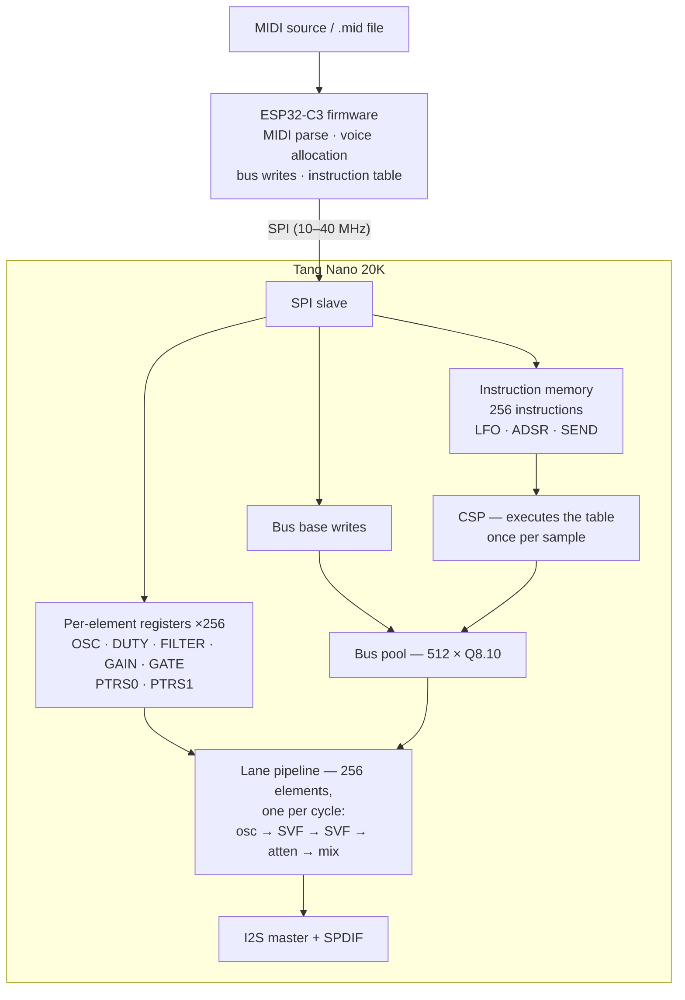
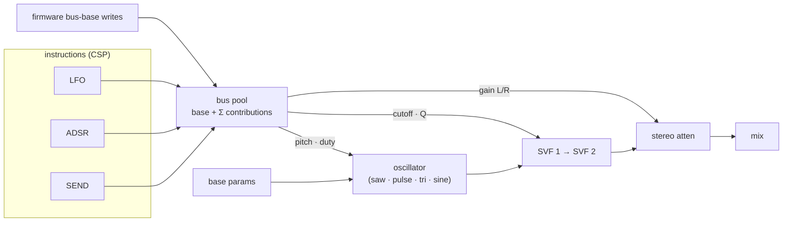

# SPI Memory Map — Noaidi Synth

Copyright © 2026 Thor H. Linløkken <thj@thj.no>
License: CERN-OHL-S v2

Register/address-space map for the ESP32-C3 ↔ FPGA SPI control interface.
Status: **NEEDS CONSOLIDATION** — this document is
behind actual progress: much of what it still calls "proposal" is
built and hardware-verified (wire protocol, per-element words,
buses, the source table), the diagrams are stale, and "producer"
should read source/sink per the settled terminology. Consolidation
is roadmap item 11 in [design.md](design.md); trust the per-section
Status columns and the design doc over prose here until then.

## Architecture stance

The FPGA is a dumb-but-fast synthesis engine: 256 independent
single-oscillator elements. It has no concept of notes, unison, polyphony,
MIDI or CCs — all of that is ESP32 firmware territory (think 256 Minimoog
voice cards behind a MIDI-to-CV converter). Consequences:

- ESP32 does voice allocation, unison grouping, CC→parameter mapping and
  velocity scaling; it expresses results as plain per-element register writes.
- **Envelopes and LFOs run in the FPGA**, as instructions in the CSP's
  instruction memory — envelopes are per-sample math, far too expensive
  to stream from firmware.
- Note-on/off is one live write to a voice's **gate bus**, which its
  envelopes watch. Quantities fixed at note-on — key tracking, velocity
  scaling, detune, pan — are baked by firmware into base parameters,
  bus bases and instruction DEPTH words; the FPGA's modulation sources
  are only things that *change during a note*.
- **Buses**: every dynamic value is a word of a 512-entry bus pool;
  each element parameter points at a bus and adds its value
  ([bus_architecture.md](bus_architecture.md)). A continuous controller
  (wheel, pedal, CC sweep) is one bus-base write, whatever the number
  of voices that point at the bus.
- **Multi-timbrality is free for per-element parameters**: every element
  carries its own params, so 16 channels can each run a different patch
  at no extra cost; shared modulation is a matter of which buses and
  instructions firmware allocates per channel.

## Block diagrams


```mermaid
flowchart TD
    MIDI["MIDI source / .mid file"] --> ESP["ESP32-C3 firmware<br/>MIDI parse · voice allocation<br/>bus writes · instruction table"]
    ESP -- "SPI (10–40 MHz)" --> SLAVE["SPI slave"]
    subgraph FG["Tang Nano 20K"]
        SLAVE --> PV["Per-element registers ×256<br/>OSC · DUTY · FILTER · GAIN · GATE<br/>PTRS0 · PTRS1"]
        SLAVE --> IMEM["Instruction memory<br/>256 instructions<br/>LFO · ADSR · SEND"]
        SLAVE --> BB["Bus base writes"]
        IMEM --> CSP["CSP — executes the table<br/>once per sample"]
        BB --> DMEM["Bus pool — 512 × Q8.10"]
        CSP --> DMEM
        PV --> PIPE["Lane pipeline — 256 elements,<br/>one per cycle:<br/>osc → SVF → SVF → atten → mix"]
        DMEM --> PIPE
        PIPE --> OUT["I2S master + SPDIF"]
    end
```

One element's signal flow:


```mermaid
flowchart LR
    subgraph SRC["instructions (CSP)"]
        L["LFO"]
        A["ADSR"]
        S["SEND"]
    end
    FW["firmware bus-base writes"] --> BUS["bus pool<br/>base + Σ contributions"]
    L --> BUS
    A --> BUS
    S --> BUS
    BUS -- "pitch · duty" --> OSC["oscillator<br/>(saw · pulse · tri · sine)"]
    BUS -- "cutoff · Q" --> SVF["SVF 1 → SVF 2"]
    BUS -- "gain L/R" --> ATT["stereo atten"]
    B["base params"] --> OSC
    OSC --> SVF --> ATT --> MIX["mix"]
```

## Conventions

- **Register width: 32 bits, uniform.** One register = one parameter (or
  one small related group). Native BSRAM words are 36-bit; a 32-bit
  register occupies one word with 4 spare bits reserved.
- **CDC via BSRAM ports**: the SPI side writes on the sclk-clocked port
  and the drum reads on the sysclk-clocked port — the dual-clock,
  dual-port BSRAM *is* the entire clock-domain crossing. No FIFOs, no
  handshakes, no inbox. **Builds cleanly, but is NOT yet functionally
  verified** — see "BSRAM CDC — measured" below. yosys infers it,
  nextpnr packs it, gowin_pack emits a bitstream, and the netlist is
  structurally correct; but the open-source flow ships no simulation
  model for the primitive, so nothing has confirmed it *behaves*.
- What BSRAM does and does not buy you. It solves the *structural*
  crossing: each port is fully synchronous to its own clock, no
  combinational path runs between domains, and there is no metastability
  on the data path. It does **not** make a read-during-write coherent —
  a word read on sysclk while it is being written on sclk can return old
  or new data for that access. That is precisely why parameter data is
  ping-ponged (atomicity is the bank swap's job, not the RAM's), and why
  the bank-select bit is the one signal in the whole scheme that genuinely
  has to be synchronised.
- **Address width: 16 bits** (65,536 words = 256 KB logical space).
- **Section sizing**: power-of-two units, at least 50% spare per unit or
  block, and 0x100-aligned only where that doesn't waste most of the
  block (no oversized reservations like 256 words for two LFOs).
- **Per-element stride: 64 words (2^6)** — 7 used, 57 reserved (89%
  headroom per voice).
- **Transaction format** (proposal): 1 command byte + 2 address bytes +
  4 data bytes per word. Command: `[7] R/W`, `[6] auto-increment (burst)`,
  `[5:0] reserved`. A burst streams words while CS is low.
- **Atomicity**: per-element register writes are independent; multi-word
  atomicity comes from the ping-pong bank swap, not from locking registers.
- **Ping-pong**: parameter data (per-element words and instruction
  memory) is double-buffered, half-active/half-shadow; the map
  exposes the active bank only. Writes always land in the shadow half
  (the sclk-side bank select is a synced complement of the active
  bank). A `CTRL` swap request executes once, at the next sample
  boundary, in an idle drum slot where no voice reads occur — that is
  the one critical cycle, and nothing but the bank pointer changes in
  it. `STATUS` reports swap completion. There is no "patch" vs "live"
  parameter class: swaps run
  thousands of times per second, everything is live, and every change
  is effected through a swap. Bus values are not swap-banked: they
  are live writes ([bus_architecture.md](bus_architecture.md)).

## Top-level map

| Address          | Section                       | Size      | Status |
|------------------|-------------------------------|-----------|--------|
| `0x0000–0x00FF`  | System / housekeeping         | 256 words | TBD |
| `0x0100–0x04FF`  | Instruction memory (256 × 4 words) | 1024 words | live (B4/B5) |
| `0x0500–0x07FF`  | Reserved (global)             | 768 words | — |
| `0x0800–0x09FF`  | Bus base registers (write-only, live — [bus_architecture.md](bus_architecture.md)) | 512 words | B1: live |
| `0x0A00–0x0BFF`  | Reserved (global)             | 512 words | — |
| `0x0C00–0x1FFF`  | Reserved (global)             | ~5K words | — |
| `0x2000–0x5FFF`  | Per-element parameters (256 × 64) | 16K words | partial |
| `0x6000–0xFFFF`  | Reserved (effects, wavetables, samples) | 40K words | — |

## System / housekeeping — `0x0000–0x00FF` (TBD)

| Offset | Register | Contents |
|--------|----------|----------|
| `0x000` | `ID` | ID/version, read-only |
| `0x001` | `STATUS` | link status, drop counters, bank-swap done |
| `0x002` | `CTRL` | global reset, kill-all-gates (panic), LED override, swap request |
| `0x003` | `MASTER` | `[7:0]` vol L UQ4.4, `[15:8]` vol R UQ4.4, `[23:16]` smoothing coeff |
| `0x004–0x0FF` | — | reserved |

No command FIFO: note-on/off is just the allocator writing per-element
`GATE` registers — nothing else in the FPGA needs to know a "note" exists.
No MIDI interpretation: the FPGA stores anonymous bus values and
knows nothing of wheels, pedals or CC numbers — every musical decision
and every mapping stays in firmware.

## Instruction memory — `0x0100–0x04FF` (live, B4/B5)

The CSP's program: entries are **instructions**, `CFG[3:0]` is the
**opcode**, and the sequencer executes them in order once per pass.
256 instructions × 4 words, stride 4, banked like parameters (config
is wiring — takes effect at the swap). Sizing, execution rate and
chaining: [bus_architecture.md](bus_architecture.md).

| Offset | Word | Contents |
|---|---|---|
| `+0` | `CFG` | `[3:0]` **opcode bitmask** — bit 0 reads a source operand, bit 1 has persistent state, bit 2 multiplies by DEPTH, bit 3 accumulates onto the target rather than starting from its initial value. An envelope is the instruction that watches a gate, so state+source means envelope and state alone means phase accumulator: `0x0` off, `0xE` LFO, `0xF` ADSR, `0xD` SEND, the bus processor. Bit 3 makes chaining explicit, so the allocator can check it. `[5:4]` LFO shape (saw/pulse/tri/sine via osc_core), `[15:6]` target bus; LFO: `[31:16]` rate — low 16 bits of the UQ0.24 phase increment (2.86 mHz steps, 187.5 Hz max); ADSR: `[25:16]` gate bus (level-sensitive, > 0 = held); SEND: `[25:16]` SOURCE bus — stateless, reads the bus's OUTPUT SUM (`dmem_local`: firmware base plus every contribution written so far; sources ordered before their sends propagate same-sample), × DEPTH (`0x10000` = unity, sign inverts), chain-adds to target |
| `+1` | `RATES` (ADSR) | `[17:0]` kA, `[31:18]` kD[13:0] — linear RC coefficients (step = (target − level) · k >> 24), decoded by firmware from the patch's 8-bit log₂ rates (`patch.c`) |
| `+2` | `DEPTH` | `[17:0]` signed **Q2.16** — the instruction's coefficient (immediate). **Unity is `0x10000`**: the product is taken as `>>> 16`, so the field spans about −2.0…+2.0. **TODO:** a gain-path format unification may move this — the proposal is Q4.14 end to end for audio, log-decoded gain and the linear gain bus, which would make this coefficient's requantization `>>14` and its unity `0x4000`. Do not treat Q2.16 as settled until that is decided. Amp-envelope idiom: initial image = −span (the quiet floor), coefficient positive — the level adds volume |
| `+3` | `RATES2` (ADSR) | `[3:0]` kD[17:14], `[21:4]` kR, `[31:22]` sustain level (10 bits of the 22-bit envelope scale) |

An instruction ADDS to its destination (word value = initial image +
results), so firmware writes and modulation coexist on one word.
**An instruction with opcode bit 3 (accumulate) set adds onto the most
recent result for the same target within the last three slots**;
otherwise it starts from the initial image. Scattered instructions
sharing a destination are therefore last-write-wins, which is why the
allocator groups them. Disabling an instruction leaves
its last value on the bus until the next base write refreshes it.

## Per-element parameters — `0x2000–0x5FFF`

Voice v base address: `0x2000 + v × 64`.

| Offset | Register | Contents | Status |
|--------|----------|----------|--------|
| `+0` | `OSC` | `[13:0]` pitch UQ4.10, `[15:14]` waveform (0 saw, 1 pulse, 2 tri, 3 sine — wider codes for noise/wavetable/sample take reserved bits when they land), `[31:16]` reserved. | implemented |
| `+1` | `DUTY` | `[23:0]` duty Q0.24 signed, `[31:24]` reserved | implemented |
| `+2` | `FILTER` | `[13:0]` cutoff UQ4.10, `[27:14]` resonance UQ4.10 **log₂** — octaves of Q above Butterworth (0 = Butterworth = heaviest decodable damping; one integer ≈ +6 dB of resonant peak; top of range underflows the decode to q1 = 0 = self-oscillation), `[31:28]` reserved. Decodes via q1_lut + barrel shift, on the cutoff-K pattern | implemented |
| `+3` | `GAIN` | `[7:0]` **volume** L UQ4.4, `[15:8]` volume R UQ4.4 (0x00 = silence/exact mute, 0xFF = loudest — a zeroed word is silent-by-default; inverted to the attenuation decode at the effective-parameter seam), `[23:16]` mode byte: `[16]` 12/24 dB, `[18:17]` filter type, `[23:19]` reserved | implemented |
| `+4` | `GATE` | `[0]` gate (0 = silent: gain decode forced to exact mute, oscillator/filters free-run — a control input, NEVER an envelope trigger: envelopes are gated by their own gate-bus reads in the source table, and the register is slated for removal), `[1]` retrig (reserved), `[31:2]` reserved | bit 0 implemented |
| `+5` | `PTRS0` | bus pointers ([bus_architecture.md](bus_architecture.md)): `[9:0]` pitch, `[19:10]` duty, `[29:20]` cutoff — 0 = bus 0 = no modulation | live (B2) |
| `+6` | `PTRS1` | bus pointers: `[9:0]` filter 1/Q, `[19:10]` gain L, `[29:20]` gain R | live (B2) |
| `+7..+63` | — | reserved (per-element LFO, glide, FM amount, sample position, ...). Envelopes live in the instruction table at `0x0100–0x04FF`, shared between elements by design. | reserved |

Notes:
- 256 elements — grouping into notes/unison is firmware's business and
  invisible here.
- Values are consumed once per sample per element; writes to a running
  element take effect at the next swap.
- `FILTER` resonance is the log₂ code above; the gateware decodes it
  to linear q1 (Q2.16, then Q8.28 at the DSP) between the bus add and
  the first filter multiply.
- ADSR rates are 8-bit log₂ in the patch (4-bit octave + 4-bit
  1/16-octave fraction); firmware decodes them to the linear
  coefficients in the instruction's `RATES`/`RATES2` words.
- Velocity and key tracking are firmware-baked into base parameters,
  bus bases and DEPTH words at note-on (key tracking that must follow
  bends rides a bus updated by firmware). Future oscillator types may need
  extra data words (wavetable index, sample pointer) — they take
  reserved words in this block.
- Controllers are computed by firmware: one bus-base or instruction
  write per event. A "global" control is simply a bus many elements
  point at.

## SPI speed budget

- Firmware default: **10 MHz**, one CS frame per transaction.
- **Measured on hardware: clean at every rate from 1 MHz to
  40 MHz.** 88/88 transactions correct — write four registers, burst-read
  them back, check the ID byte and all four values, ×8 repetitions at each
  of 11 rates. 40 MHz is the ESP32-C3's ceiling for SPI2 through the GPIO
  matrix (the configured pins are not the IOMUX ones), not a limit of the
  link: nothing had started to degrade. The jumper wiring, suspected here
  as the likely limiter, is not one.
- nextpnr reports the `u_spi.sclk` domain closing at 230–269 MHz, so the
  slave has enormous margin; the master is the constraint at every rate.
- Raising the firmware default is therefore a free change whenever the
  traffic justifies it.
- Traffic model with firmware-side MIDI semantics:
  - Note-on/off: `GATE` + patch writes for ≤ 8 voices ≈ 30–60 words per
    key — a few ms at 1 MHz, sub-ms at 10 MHz.
  - Any dense continuous source (expression pedal, wheel, CC sweep):
    **1 bus-base write per event** — effectively free, for any
    number of voices, on any channel, all arrangement long.
  - Direct per-element parameter writes (rare, discrete changes): cheap.
  - Envelopes and LFOs run inside the FPGA — zero SPI traffic.
- Conclusion: with 40 MHz measured good, the speed budget is a solved
  problem. Even firmware writing per-element parameters directly, ~2.9 Mbit/s for a 200 Hz pedal sweep across 256
  voices — fits inside 10% of the link. 1 MHz remains marginal for
  full-voice CC sweeps, so that is the number to raise, not the design.

## Known limits vs a full polysynth

- **One oscillator per voice.** Two-oscillator features (hard sync,
  osc-level FM/ring mod) would need a second phase accumulator plus a
  second OSC/DUTY parameter set (reserved words exist; pipeline +3–4
  stages). Cross-*voice* modulation is impossible in SCMO — voices never
  see each other's state.
- **Per-note poly pressure**: firmware writes it to a per-voice bus on
  poly-pressure events.
- **Long effects delays need external memory**: total FPGA BSRAM is
  828 kbit. The reserved effects region is logical address space only; a
  1 s stereo delay at 96 kHz/24-bit is ~4.6 Mbit.
- **Noise oscillator** (reserved type 4+) needs a small global LFSR.
- Everything else standard (glide, key tracking, pan, unison detune and
  spread, velocity curves, splits/layers, arpeggiator, chord memory,
  damper/sostenuto) is firmware-side and fully supported by this map.

## Decisions (from discussion)

1. **Buses**: one uniform pool of 512 signed Q8.10 words
   ([bus_architecture.md](bus_architecture.md)).
2. **Pointers**: six bus pointers per element, in `PTRS0`/`PTRS1`.
3. **ADSRs**: 2 per voice (amp + MOD), each one instruction with two
   rate words; the 8-bit log₂ → coefficient decode lives in firmware.
4. **Per-element stride**: 64 words — 7 used, 57 reserved.
5. **Bursts**: stream words until CS goes high (no length field).
   Implemented for the 8-bit bring-up registers: one `spi_device_transmit`
   per transaction, address auto-increments on the FPGA side
   (`rtl/spi/spi_slave_regs.sv`). Still to do at 32-bit width.
6. **Integrity**: no CRC — trust the short link. Justified: the wiring
   was measured error-free at 40 MHz, the ESP32-C3's maximum, so the
   link has margin to spare at any rate the design would actually use.
7. **Ping-pong**: from the start for parameter data, swapped at the
   sample boundary in an idle slot. Risk note: yosys *does* infer
   dual-clock BSRAM and the
   ping-pong bank-select bit does not disturb it — the variant maps to
   the same 4 blocks. What remains open is not inference but
   **verification**: the toolchain cannot simulate what it generates, so
   the inbox/commit fallback should not be discarded until the BSRAM path
   has been exercised on real silicon.

## BSRAM CDC — measured

Tested on the real toolchain (yosys 0.67, nextpnr-himbaechel,
gowin_pack, GW2AR-LV18QN88C8/I7), because decision 7 rested on an
assumption nobody had checked.

| Pattern | Result |
|---|---|
| Semi dual-port, 2 clocks (write sclk / read sysclk), 2048 × 36 | **4 × `DPX9B`** — inferred, packed, bitstream emitted |
| Same + ping-pong bank-select bit in the address | **4 × `DPX9B`** — inference unaffected |
| True dual-port, 2 clocks, both ports read **and** write | **fails**: `ERROR: no valid mapping found for memory` |
| 256 × 36 | 0 blocks — yosys picks LUT-RAM below roughly a block's worth |

Place-and-route on the real part: `BSRAM 4/46`, the two clock domains
closing at 549 MHz and 495 MHz against the 98.304 MHz constraint. The
memory is nowhere near being the timing limit.

Netlist audit (what can be checked statically): `CLKA` is driven by the
write clock and `CLKB` by the read clock — genuinely distinct nets, not
a collapsed single domain. Write-enable appears only on the A port.
Four instances at `BIT_WIDTH 9` compose the 36-bit word. The structure
is right.

### The limitation that matters

**The open-source flow cannot simulate the BSRAM it generates.** Every
Gowin BSRAM primitive in oss-cad-suite — `SP`, `SPX9`, `SDPB`,
`SDPX9B`, `DPB`, `DPX9B`, `pROM` — is a blackbox in
`cells_xtra_gw2a.v`: ports and parameters, zero behavioural lines. A
post-synthesis simulation does not merely fail to match, it will not
elaborate:

```
post_synth.v:203: error: Unknown module type: DPX9B
```

So for BSRAM specifically, "it builds" is the *entire* strength of the
evidence available in this flow. That is a weaker position than it first
appears, and it is worth being blunt about: a behavioural simulation of
the source RTL passes trivially, because a plain array is not what gets
built.

Three ways out, in order of preference:

1. **Install the Gowin IDE for its simulation models.** The vendor ships
   real behavioural models for these primitives. This is the
   delegate-to-the-specialist answer: the models come from whoever built
   the silicon, and post-synthesis simulation becomes possible.
2. **A hardware self-test.** A BSRAM CDC checker on the FPGA — pattern
   written from one clock domain, verified continuously from the other,
   result reported over the (now working) SPI link. Validates the real
   silicon rather than a model of it, and is worth having permanently
   as a bring-up check.
3. ~~Write our own `DPX9B` model.~~ **Don't.** It would validate the
   design against our own assumptions about the primitive, which is the
   exact technical debt this architecture exists to avoid. A model we
   wrote proves only that we are self-consistent.

Two consequences worth carrying forward:

- **Drum-serviced read-back is mandatory, not an optimisation.** Because
  true dual-port does not map, the SPI side cannot both write and read
  the same BSRAM, so any read-back must be serviced from the sysclk side
  — a hard requirement, not a preference.
- **The 64-word per-element stride is address space, not RAM.** Measured
  cost is 18,432 bits per block, linear: 1024 words × 36 → 2 blocks,
  4096 → 8, 16384 → 32. Instantiating the *full* 256 × 64 stride would
  consume 32 of 46 blocks — 70% of the part's BSRAM — for parameters
  alone, before LUTs, voice state, the bus pool or instruction memory.
  Only the used words per voice are instantiated (7 per element). The address map's generous reservations cost nothing as
  long as nobody builds an array to match them.

